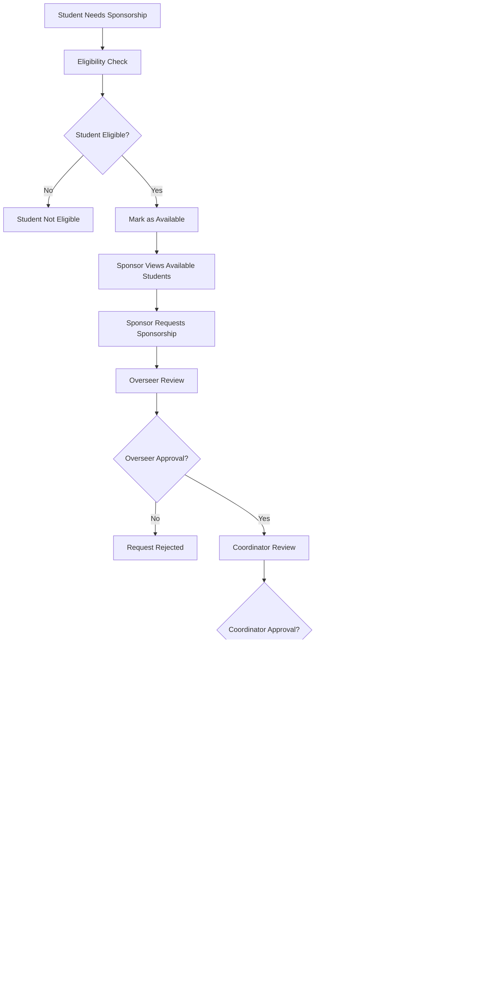

# School Management System (SMS) - Complete Flow Chart

## System Architecture Overview

## User Authentication & Authorization Flow

## Student Management Flow

## Sponsorship Management Flow

## Financial Management Flow

## Attendance Management Flow

## Messaging System Flow

## Privilege System Architecture

## Data Flow Architecture

## System Components Overview

### Core Modules:
1. **Authentication & Authorization** - JWT-based with granular privileges
2. **Student Management** - Complete student lifecycle management
3. **Teacher Management** - Teacher assignments and analytics
4. **Class & Stream Management** - Academic structure organization
5. **Attendance System** - Real-time attendance tracking
6. **Financial Management** - Fee structure and payment processing
7. **Sponsorship System** - Multi-stage approval process
8. **Health Records** - Clinic management and tracking
9. **Messaging System** - Role-based communication
10. **Resource Management** - File uploads and sharing
11. **Analytics & Reporting** - Comprehensive data insights
12. **System Administration** - Settings and maintenance

### Key Features:
- **Role-Based Access Control** with 9 different user roles
- **Granular Privilege System** with 200+ specific permissions
- **Time-Limited Privileges** with automatic expiration
- **Multi-Stage Sponsorship Process** with overseer and coordinator approval
- **Real-Time Messaging** with role-based restrictions
- **Comprehensive Analytics** across all modules
- **File Management** for photos, documents, and resources
- **Academic Tracking** with report cards and progress monitoring
- **Financial Tracking** with payment methods and overdue management
- **Health Management** with clinic records and follow-up tracking

### Technology Stack:
- **Frontend**: React 18, TypeScript, Tailwind CSS, Vite
- **Backend**: Node.js, Express.js, TypeScript
- **Database**: PostgreSQL with Prisma ORM
- **Authentication**: JWT tokens with bcrypt password hashing
- **File Storage**: Local file system with static serving
- **API**: RESTful API with comprehensive error handling
- **Security**: CORS, input validation, privilege-based access control

This system provides a comprehensive school management solution with robust security, flexible user roles, and extensive functionality for managing all aspects of school operations.

## Grading and Student Positioning

### Grade Bands
- A: 80–100
- B+: 75–79
- B: 70–74
- C+: 65–69
- C: 60–64
- D+: 55–59
- D: 50–54
- F: 0–49

These bands are editable in Settings ➜ System ➜ Grade System. Each band carries a comment that can be printed on reports.

### Computation
For each term and student:
1. For every subject, compute subject total = sum of all assessed components for the term.
2. Compute overall totals:
   - totalMarks = sum(subject total for all subjects attempted)
   - subjectsCount = number of subjects with a valid score
   - average = round(totalMarks ÷ subjectsCount, 2)
   - grade = band where average falls

### Positioning Algorithm
Positioning is done at three levels: class, stream, and overall (whole school for the term).

Sort students within each cohort using the comparator below, then assign 1, 2, 3, …; students with identical metrics share a position and the next position is skipped accordingly (1, 2, 2, 4 …).

Comparator (in priority order):
1. Higher average first
2. If tie, higher totalMarks
3. If tie, more subjectsCount (attempted subjects)
4. If tie, higher weighted core-subject score (Math + English + Science + Social Studies if available)
5. If tie, higher attendance rate for the term
6. If tie, alphabetical order by lastName, firstName (stable)

### Stored Fields (per student, per term)
- totalMarks
- average
- grade
- positionClass
- positionStream
- positionOverall
- tieBreakMeta: { coreScore, attendanceRate, subjectsCount }

### Recompute Triggers
- On score entry/update/deletion
- On grade band changes in Settings
- On subject enrollment changes

The recompute job updates the stored fields and emits events for report generation and analytics.